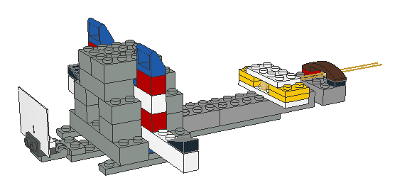
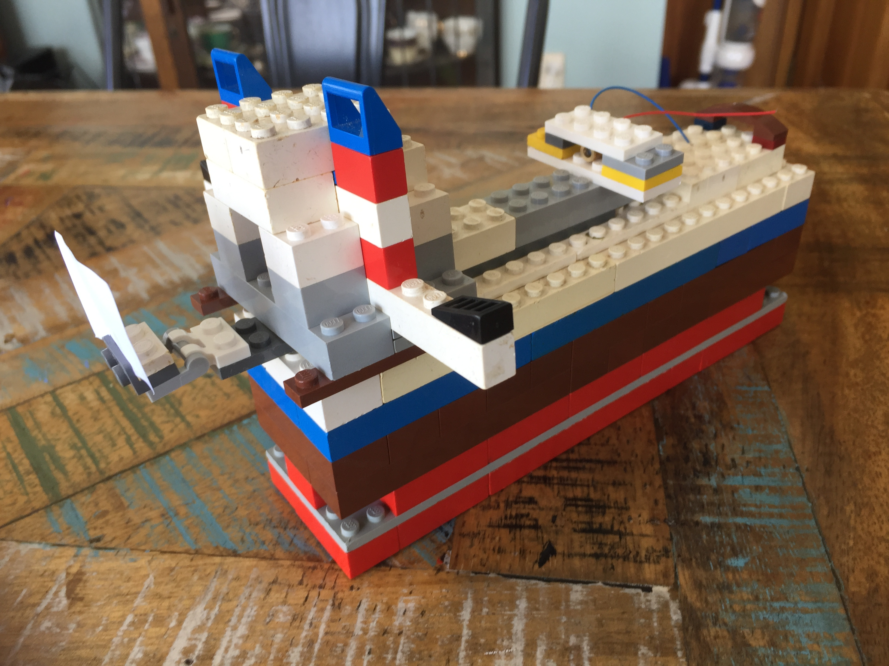
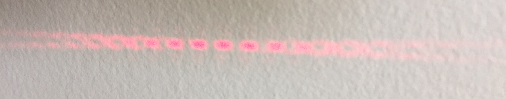
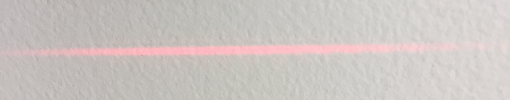

# LEGO Double Slit Experiment

This repo contains build instructions for a LEGO rig to conduct the famous [double-slit experiment](https://wikipedia.org/wiki/Double-slit_experiment),
first performed by [Thomas Young](https://wikipedia.org/wiki/Thomas_Young_(scientist)) in 1801, which demonstrates both the particle and wave behaviour of light.

It uses a cheap laser diode as the light source, and everyday white printer paper (80gsm) hand cut with an x-acto style craft blade for the slitted plate.

## Motivation

How to convincingly and reliably block one slit at a time (a slit toggle) during a single run of a double-slit experiment?

Rather than setting up two different experiments to show the difference, I wanted to have something stable enough to be toggled by
someone unfamiliar with the equipment or the experiment so they could see directly and hands-on the effect of toggling the slit openings.

The rig needed to be robust enough to handle the experiment surface (i.e. table) being bumped while retaining calibration, and cope with being bumped itself, picked up while
operating, and re-positioned or angled slightly with the laser operating (don't point lasers at people!), and still exhibit togglable slit interference.

* I wanted something that could be set up easily within <5 minutes, so if a visitor casually said "I've always wanted to perform the double-slit experiment", I could say I had one sitting in a box, and we could just get it and be done in minutes.
* Something somewhat portable to potentially demonstrate in other locations, with <5 min set up also. Currently the power-supply is the challenge, but a battery pack would suffice. (Ideally this would be made of LEGO too).

The current rig does need to be calibrated once before operating. The slit-plate position and angle needs to be aligned precisely with the laser pointer, and this can rely on 'twisting' and
partially connecting some of the LEGO studs in the rig. Cutting the slits freehand seems to be the quickest way to get a usable result, and cheap laser diodes don't necessarily point straight either.

Fortunately the precise LEGO joints allow them to be partially connected and still retain a decent mechanical stability that should last the duration of an experiment.

The rig will most likely need to be re-calibrated between runs, and I'd recommend cutting a fresh slit-plate each time anyway. The relatively thin paper tends to bend and lose definition with handling.

This started as a mock-up to model something which could be 3D printed, but the basic design worked well enough for me to run with it.

The initial design goal of having either slit togglable has not been realised. There is a large gap between the two shutters that cannot block the entire laser beam, but by playing with the LEGO connections
it was simple enough to find a position that clearly blocked at least one slit with one slider pushed all the way in, in a way that didn't require precise handling of the slider, after initial calibration.

* 'Expert' calibration is performed once (somewhat efficiently) on setup by the experimenter
* Slits can then be toggled at will by others, who don't need to be *too* careful about breaking the calibration

Obviously the equipment is still sensitive, and should not be dropped or hit,
but previously I've done this in a way that someone nearby moving, tugging a wire, leaning on the table, or breathing too much breaks the setup and it takes 30 minutes plus to recreate the working conditions (this may be *slight* exaggeration).

## Non-LEGO parts

Only two non-LEGO parts are required.

* A cheap low-powered laser diode. (6mm diameter)
* A hand cut piece of 80gsm paper for the plate.

I powered my laser diode (red, 650nm) directly from a bench power-supply with no extra circuitry other than the built-in current limiting resistor. This is not the best way to use a laser diode, and there is a risk the diode could fail, but it's simple and often cheap consumer devices using these don't have decent protection circuitry either, and they work well enough. I bought a bag of 20 from eBay -- these are the unbranded 6mm brass housed ones which come bulk in either 5V or 3V configuration (either will work here). They all seem to have one red and one blue wire for power. The most important attribute is the 6mm barrel size to fit with the LEGO. Use and power your lasers at your own risk.

Paper slit-plate:  A small rectangle, roughly 25 x 40mm of 80gsm paper, with the slits between 3-4mm long (not critical, it's hard to make shorter cuts by hand, whatever works). They should be as parallel as possible, and the crucial part is that they are *close together*. 0.5mm (half a millimeter) works well. I found it difficult to measure in advance, so cutting as close as possible without tearing the paper using a sharp x-acto type paper-craft knife works. Scissors or box-cutter knives may not be fine enough for this. If your resulting slits are anywhere close to 0.5mm apart, it will work.
The paper weight of 80gsm is about as low as it can be -- thinner paper will cause problems. I didn't want the paper too thick ensuring the slits were clean, and as '2D' as possible.
At this scale, thicker paper might form a tunnel rather than a slit. Slightly thicker paper *may* work, and could last longer, but I have not yet tried it.

I modelled these parts exactly as possible using OpenSCAD, and converted them using the `stl2dat` tool to include them in the LeoCAD model.

## Results

Design:

Build, with a 6 stud wide, 6 brick + 1 plate high base for stability:
(some of this LEGO happens to be old, please excuse the dirt)

Double slit interference pattern using this rig:

Single slit pattern:

The above photos were taken indoors during the day, with no effort to limit surrounding light. The intent is that this is easy to set up, and the results are still clear.

## Software tools used

* [LeoCAD](https://www.leocad.org/) for LEGO modelling
* [OpenSCAD](https://openscad.org/) for non-LEGO parts and .stl conversion
* [stl2dat](https://github.com/ondratu/stl2dat-cp) for converting .stl to LDraw models for use in LeoCAD

## Extensions
TODO:
* Quantum eraser version with polarisers: https://doi.org/10.1038%2Fscientificamerican0507-90

